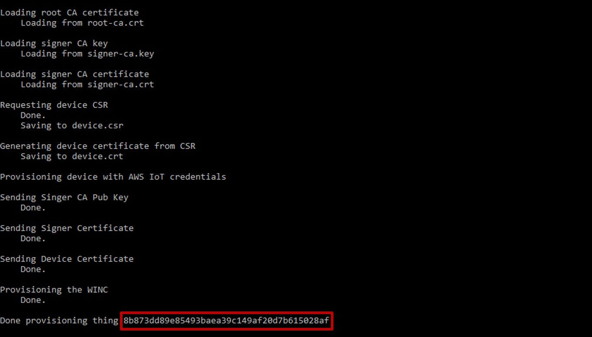
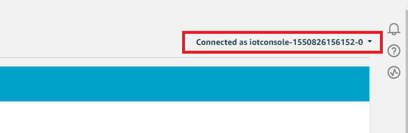
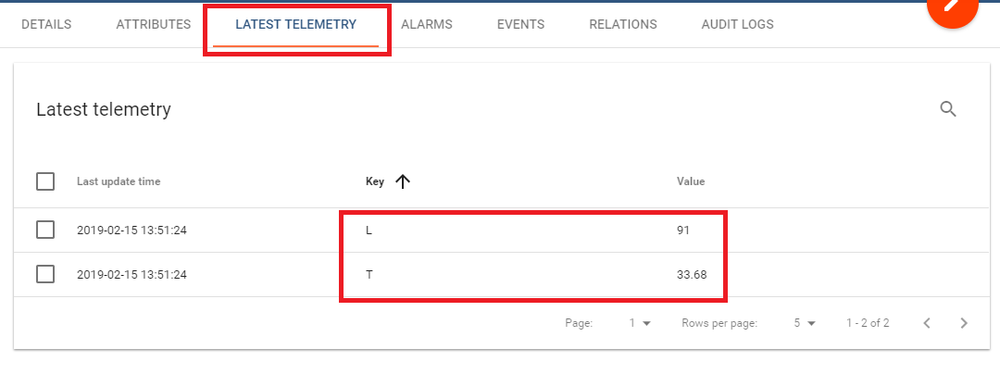

# Repurpose AVR-IoT WG to Connect to AWS

Uses: ATmega4808, ATWINC1510, ATECC608A, AWS IoT Core, ThingsBoard

This repository contains the source code for the application described in [Repurpose AVR-IoT WG to Connect to AWS](http://ww1.microchip.com/downloads/en/AppNotes/AN3089-Repurpose-AVR-IoT-WG-to-Connect-to-AWS-00003089A.pdf) document from Microchip.

## Instructions

1. Follow the [Zero Touch Secure Provisioning Kit for AWS IoT](http://microchipdeveloper.com/iot:ztpk#top-of-page) guide until section ```VII. Provision the Device``` to configure the AWS account. The code used by the Zero Touch kit is in this [repository](https://github.com/MicrochipTech/aws-iot-zero-touch-secure-provisioning-kit).

**Note**
 - Some naming in the AWS console might have changed, but the new names are intuitively
similar to the old ones. If there is any issue running ```aws_register_signer.py``` (or other
scripts), see this [fix](https://github.com/MicrochipTech/aws-iot-zero-touch-secure-provisioning-kit/issues/4). A similar fix can be applied to other scripts
 - This first step is the most difficult to replicate!

2. Program the AVR-IoT WG with the provisioning firmware in the folder ```ecc-provision``` of the code repository.
3. Copy the ```scripts/provision/manual_kit_provision.py``` script to the folder where the root CA and signer CA were created, in step 1.
4. Using a terminal, install ```pyserial``` using pip: ```pip install pyserial``` or ```python -m pip instal pyserial```.
5. While AVR-IoT is still connected to the PC execute ```manual_kit_provision.py``` in its new
location. COM port (on Windows™) or the USB file (on Linux/macOS) must be specified. Here is an
example command: ```python manual_kit_provision.py COM10```. The output should look
similar to the image below and the execution time should not take longer than five seconds.

**Note**
 - This script also shows the name the device (also called the Thing) will have in the AWS.
Save this name for future use.



6. The default SSID and password for Wi-Fi network are ```MCHP.IOT``` and ```microchip```. To change
them, edit the ```demo/avr.iot-aws-demo/cloud/cloud.h``` file.
7. In ```demo/avr.iot-aws-demo/cloud/cloud.h``` there is a ```#define AWS_HOST_ENDPOINT```, which needs to be updated. Go to the **AWS IoT Core Console > Test**, and in the upper right corner, there is a dropdown titled **Connected to iotconsole-xxx-x**; click it and select **View endpoint** and a sidebar will slide in from the right. Copy the endpoint. Its first part contains a ‘-ats’ suffix that must be removed. Therefore, for example ```a3mnn069kqq6d6-ats.iot.uswest-2.amazonaws.com``` becomes ```a3mnn069kqq6d6.iot.us-west-2.amazonaws.com```.
The endpoint without the ‘-ats’ suffix is the value of the ```#define AWS_HOST_ENDPOINT in demo/avr.iot-aws-demo/cloud/cloud.h```.



8. In ```demo/avr.iot-aws-demo/cloud/cloud.h``` there is a ```#define AWS_THING_ID```, which needs to be updated. Its value must be the Thing name the terminal displayed in step 5.
9. Program the AVR-IoT WG with the firmware in the ```/demo``` project.
10. The first time this code runs, the red LED will flash once, as it starts and does the JITR but the connection fails. The code auto-recovers and reconnects automatically. This only happens during the first connection.
11. Visit ```AWS Console > IoT Core > Manage > Things``` and there will be a new Thing in the Things list, and its name is the one shown at step 5. Copy the Thing name.
12. View messages in ```AWS Console > IoT Core > Test```. In the ‘Subscription topic’ field, paste the Thing name and append ‘/sensors’. This will subscribe to a topic that looks like ```aa0b820832ee20f38d88c072a7c192cfe426683c/sensors```.
13. Click **Subscribe to topic** and it will start showing messages received in real time.


### Create the Lambda to Receive Device Messages

1. In the AWS Lambda console, click **Create function**, give it a name and use the role ZTLambdaJITRRole.


2. In the function screen, on the left side, under ‘Designer’, there is a section called ‘Add triggers’; in this section, click **AWS IoT**.


3. A section called ‘Configure triggers’ will open below; select **‘Custom IoT rule’**.
4. In the rule dropdown, select **‘Create a new rule’**.
5. Give the rule a name and a description; for ‘Rule query statement’ copy ```SELECT * FROM <YOUR_THING_NAME>/sensors``` and replace ```<YOUR_THING_NAME>``` with actual Thing name.


6. In the ‘Designer’ section, the main area shows a tree-like image; click the uppermost block in the tree, the one labeled with the function name.


7. A new section called ‘Function code’ will open below the ‘Designer’ section. In the ‘Code entry type’ dropdown, select **‘Upload a .zip file’**.


8. Upload the ```.zip``` in ```scripts/lambda/forward_to_thingsboard```.
9. Click **‘Save’** in the upper left corner of the page.

### Visualize Chart on ThingsBoard

1. Go to [ThingsBoard](https://demo.thingsboard.io/signup) and create an account; an activation link will be sent via email.
2. Login into the ThingsBoard account and go to Devices page; click the Floating Action Button (FAB) in the lower right corner to create a new device.


3. Click the card with the name of the newly created device and a sidebar will slide in from the right of the screen, there click the **‘Copy access token’** button.


4. Go into AWS Lambda Console page of the function previously created.
5. In the ‘Function code’ section, make sure ‘Edit code inline’ is selected in the ‘Code entry type’ dropdown and in the editor, there will be the files previously uploaded as ```.zip```.
6. In ```index.js``` on line 6 replace ```<ACCESS_TOKEN>``` with the access token just copied from ThingsBoard.


7. Click **‘Save’** in the upper left corner of the page.
8. Connect the board and make sure it is sending data (the yellow LED toggles once a second).
9. Go back to ThingsBoard, on the Devices page, and click the card with the device name on it. A sidebar will slide in from the right containing several tabs; click the tab titled **‘Latest Telemetry’** and a table with two rows will appear. The Key column values are ‘L’ for light and ‘T’ for temperature;
the Value column will update about once every second with data received from the board.



Now that the data made it all the way to the ThingsBoard server, it is time to configure a dashboard to plot them.

10. In ThingsBoard, go to the Dashboards page.
11. Click the FAB in the lower right corner to create a new Dashboard.


12. Click the card with the name of the newly created dashboard and move to the Dashboard page.
13. Click the FAB in the lower right corner to edit the Dashboard.
14. In the upper right corner, below the name, there are some icons; click the second one to the left, called **‘Entity aliases’**, and a modal window will open.


15. Click **‘Add alias’** and give it a name; in the ‘Filter type’ drop-down, select ‘Single entity’; for ‘Type’ select ‘Device’, and, for **‘Device’** select the device created, then click **‘Add’**.


16. Click ‘Save’.
17. In the center of the screen, there is a button called **‘Add new widget’**; click it and a sidebar will slide in from the right.
18. In the ‘Current bundle’ drop-down select **‘Charts’** and scroll down to the **‘TimeSeries - Flot’** type of chart. Click it and a modal window with configurations options will show.


19. Under ‘Datasets’ click ‘Add’.
20. The type will be ‘Entity’; for ‘Entity alias’ select the alias previously created.
21. In the ‘TimeSeries’ drop-down, the device data will load. To show a light chart, select **‘L’** and click **‘Add’**.


22. Similarly, add a chart for temperature.
23. In the lower right corner, there are three FABs; click the one with a tick to complete dashboard customization.

The configuration is now ready. The user can now see the live data displayed on charts, just like in the
image below.


